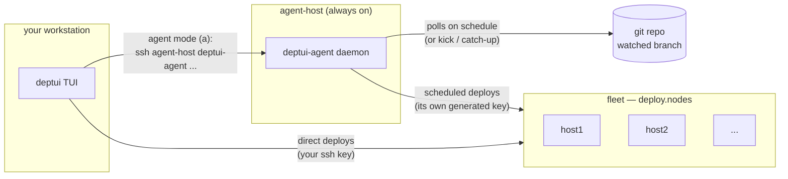
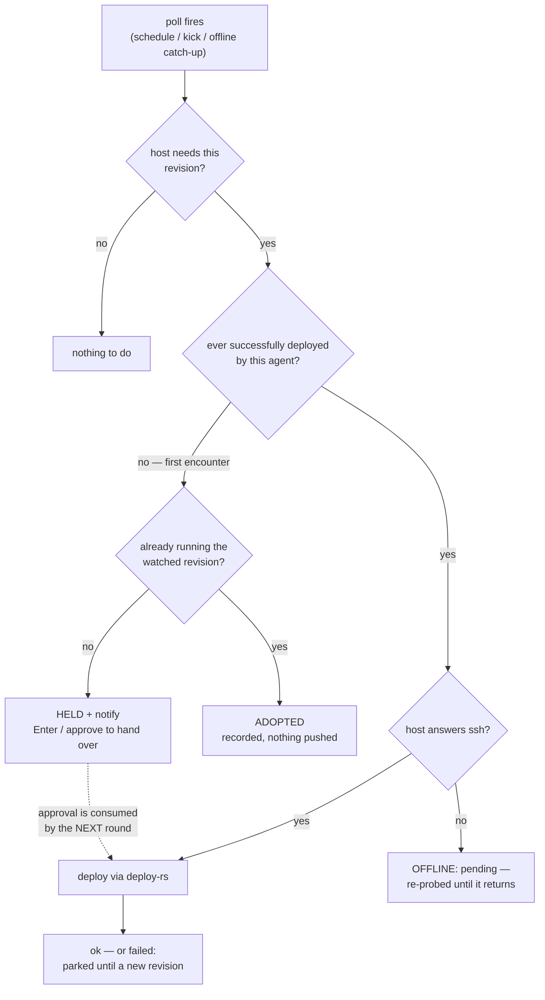

# Getting started

(Anything in `<angle-brackets>` below is yours to replace — e.g.
`<agent-host>` is the hostname/IP of the machine running the agent.)

## Prerequisites

- **A flake with `deploy.nodes`** — deptui drives
  [deploy-rs](https://github.com/serokell/deploy-rs); if your flake
  doesn't define deploy-rs nodes yet, set that up first (deploy-rs's
  README covers it). deptui does not need deploy-rs installed —
  its packages wrap `deploy`, `nix`, and `ssh` themselves.
- **Nix with flakes enabled** on your workstation (and NixOS on the
  agent host if you want the agent module).
- **SSH access** to your hosts as the `sshUser` your nodes declare.

Two pieces — the TUI stands alone; the agent is optional on top:

- **`deptui`** — a terminal UI for [deploy-rs](https://github.com/serokell/deploy-rs):
  host status, update probes, preflights, and deploys, for any flake
  with `deploy.nodes`.
- **`deptui-agent`** *(optional)* — a daemon that watches your git
  repo and deploys updates on a schedule, with the TUI as its remote
  control. Skip section 2 entirely if you only want the TUI.

## 1. The TUI

No install needed to try it:

```bash
nix run github:jdguillot/deptui -- /path/to/your/flake
```

The flake ref can be anything `nix` accepts — a local checkout,
`github:you/infra`, etc. You'll see every `deploy.nodes` host with
reachability dots and per-profile badges.

To install just the TUI permanently:

```nix
# flake input
inputs.deptui.url = "github:jdguillot/deptui";

# NixOS
environment.systemPackages = [ inputs.deptui.packages.${pkgs.system}.deptui ];
# …or home-manager
home.packages = [ inputs.deptui.packages.${pkgs.system}.deptui ];
```

(or imperatively: `nix profile install github:jdguillot/deptui`). The
package wraps `deploy`, `nix`, and `ssh` onto its PATH, so nothing
else is required.

The keys to know on day one: `r` refresh, `u` update check, `Space`
mark hosts, `Shift+S` deploy (switch), `x` cancel, `?` the full cheat
sheet. Everything is also clickable.

## 2. The agent (optional)

The agent runs on an always-on machine (it can be one of your deploy
nodes — self-deploys are safe) and needs three things: the module
enabled with a watch, its ssh key authorized on the targets, and
passwordless activation on the targets.

How the pieces talk — you keep deploying directly whenever you want,
and the agent deploys on its schedule; pressing `a` in the TUI
remote-controls the agent over ssh:



(agent-host may itself be one of the fleet nodes — the module makes
self-deploys survive their own activation.)

### Enable it

```nix
# flake input
inputs.deptui.url = "github:jdguillot/deptui";

# the agent host's NixOS configuration
imports = [ inputs.deptui.nixosModules.deptui-agent ];

services.deptui-agent = {
  enable = true;
  # "infra" is your name for this watch; the keys under `hosts` are
  # NOT arbitrary — each must match a node name in the watched
  # flake's `deploy.nodes` ("host1"/"host2" stand in for whatever
  # your nodes are called).
  watches.infra = {
    repo = "git@github.com:you/infra.git";  # or https://…
    branch = "main";                        # or tag = "prod" (a moving tag)
    interval = "15m";                       # or cron = "0 */6 * * *"
    hosts.host1 = { };                      # ← deploy.nodes.host1, deploy-rs defaults
    hosts.host2 = { remote_build = true; }; # ← deploy.nodes.host2, per-host overrides
  };
  # who may control the agent over ssh / from the TUI (socket access):
  users = [ "yourname" ];
};
```

Deploy the agent host:

```bash
# All of these run against YOUR infra flake (the one with
# nixosConfigurations) — cd there first, or spell the path instead
# of `.` (e.g. --flake ~/infra#<agent-host>).

# the nice way — you installed deptui in section 1: select the agent
# host, Shift+S, confirm:
deptui .
# …or plain nixos-rebuild from your workstation:
nixos-rebuild switch --flake .#<agent-host> \
  --target-host <you>@<agent-host> --elevate=sudo
#   (older nixos-rebuild spells that flag --use-remote-sudo; if the
#    target's sudo asks for a password, add --ask-elevate-password.
#    Caveat: nixos-rebuild also prints the --ask-elevate-password hint
#    whenever the remote command exits non-zero for ANY reason — if you
#    got a wall of activation output first, the switch likely landed:
#    check `readlink /run/current-system` and `systemctl --failed`
#    on the target before re-running.)
# …or on the agent host itself:
sudo nixos-rebuild switch --flake .#<agent-host>
# …or raw deploy-rs:
deploy .#<agent-host>
```

On first start the agent **generates its own ssh identity** — no
secrets management; the private key never leaves the machine.

### Authorize its key

```bash
ssh <agent-host> deptui-agent pubkey   # <agent-host> = where the agent runs
```

Add the printed line to the deploy user's `authorized_keys` on every
target —
declaratively, e.g.:

```nix
users.users.yourname.openssh.authorizedKeys.keys = [
  "ssh-ed25519 AAAA… deptui-agent@<agent-host>"  # paste pubkey's output verbatim
];
```

and deploy the targets once — deptui makes the batch easy: `deptui .`,
mark each target with `Space` (the host list shows a `+` per mark),
then one `Shift+S` deploys them all in sequence. Or per host from the
shell:

```bash
deploy .#<host1> && deploy .#<host2>
```

Host keys need no setup: the agent
trusts a target on first contact and pins it from then on
(`hostKeyChecking = "strict"` if you'd rather pre-pin via
`programs.ssh.knownHosts`).

The targets must accept **non-interactive activation**: a root deploy
user, or NOPASSWD sudo for the deploy user. A headless daemon cannot
answer prompts — anything that would prompt fails fast instead. On
NixOS targets:

```nix
security.sudo.extraRules = [{
  users = [ "yourname" ];
  commands = [ { command = "ALL"; options = [ "NOPASSWD" ]; } ];
}];
# (or simply security.sudo.wheelNeedsPassword = false; if you already
#  treat wheel that way)
```

> [!IMPORTANT]
> **Why not scope the rule to the one command deploy-rs runs?**
> Because that command is a *store path that changes every generation*
> (`sudo /nix/store/<hash>-…/activate-rs …`), a scoped rule must
> wildcard it — `NOPASSWD: /nix/store/*/activate-rs` or similar. And on
> a Nix machine that wildcard is root: any local user can ask the nix
> daemon to materialize a store path with any content under a matching
> name (that is what `nix build` *is*), so the deploy user could build
> their own "activate-rs" that execs a shell and sudo it. Pinning the
> exact hash instead is a chicken-and-egg: the deploy that would
> install next generation's rule needs the permission before it runs.

So an agent-managed host has exactly two configurations:

- **NOPASSWD `ALL` for a dedicated deploy user** — root-equivalent,
  but visible, auditable, and independently revocable (its own key,
  its own journal identity). This is what every deploy tool of this
  family (deploy-rs, colmena, morph) assumes.
- **`sshUser = "root"`** (with `PermitRootLogin prohibit-password`) —
  the same trust stated more plainly: one credential that *says* it
  is root, no sudo indirection at all.

If neither is acceptable for some host, the consequence is simply
that **that host cannot be agent-managed** — leave it out of the
watches and deploy it from the TUI instead, where `--interactive-sudo`
(toggle `5`) lets you keep passworded sudo and type it per deploy.
(There is deliberately no "agent reads the sudo password from a
file" mode: a stored, reusable human password is strictly more
sensitive than a dedicated ssh key, so it would weaken your setup
while pretending to harden it — agent config rejects
`interactive_sudo` outright.)

Either way, root-equivalence is inherent to unattended deployment —
the design goal is keeping it visible, not pretending a wildcard
contains it. deptui ships no option to write this rule because it
belongs to the *target's* config (a different machine than the agent
module manages).

### Check the chain

```bash
ssh <agent-host> deptui-agent validate
```

This diagnoses the agent's identity first (missing / passphrase /
ok — printing the public key), then probes every configured host.
Each failure names its own fix.

### Updates and config changes: when they actually take effect

Deploying the agent host does **not** restart a running agent — that
is deliberate (`restartOnUpdate = false` by default). An agent that
deploys its *own* host would otherwise be killed by its own
activation mid-run: the deploy driver, deploy-rs's confirmation, and
the service itself all die together, leaving the unit stopped.

Instead the daemon watches the installed unit itself (once a minute)
and hands over **at the next idle moment** — exiting cleanly so
systemd's `Restart=always` starts the new version. This covers both
halves of the unit:

- **a new binary** (you deployed a newer deptui-agent), and
- **a new config** (you changed `services.deptui-agent.*` — watches,
  keys, notify hooks; the generated TOML is part of `ExecStart`, and
  the daemon compares the file's *content* against what it loaded at
  startup).

So after a switch, expect up to a minute — or, if a run is in flight,
the moment it finishes — before the new binary/config is live. The
journal says which it noticed: `updated agent binary/config detected`.
`systemctl restart deptui-agent` is always a safe manual override
when the agent is idle.

Two situations still need a hand:

- **`autoRestartWhenIdle = false`**: you opted out of the handover, so
  *every* binary and config change needs a manual
  `systemctl restart deptui-agent` after the switch. Until you
  restart, the daemon keeps running with its old in-memory config —
  a classic confusing symptom is an error naming a config value (a
  key path, a repo URL) you already fixed.
- **Agents older than v0.17.0** only noticed binary changes; config
  changes always needed the manual restart.

### First encounters: the agent asks before it takes over

The agent never blind-deploys a host it has never deployed. On first
contact it probes: already running the watched revision → **adopted**
silently; anything else → **held**, and you get notified. Approve the
takeover with `deptui-agent approve HOST` (or `Enter` in the TUI's
agent view — it warns that the next round will move the host off
whatever was deployed outside the repo). Approval is consumed by the
next scheduled poll, kick, or catch-up — the agent never deploys the
moment you approve. Pure-GitOps hosts can opt out with
`bootstrap = "deploy"`.

What one poll does per host:



Also good to know: a host that is *down* when an update arrives is
pending, not failed — the agent re-probes it and deploys when it
answers (`catch_up = false` per host opts out). A *failed* deploy
parks the host until a new revision, a kick, or an approval. `pause`
stops future polls; `cancel` stops a run already in flight.

### Drive it from the TUI

On your workstation, just press `a`. The TUI scans your deploy nodes
for hosts answering `deptui-agent status` and connects — no client
config needed. (An agent that isn't a deploy node can be pinned in
`~/.config/deptui/config.toml`: `[agents.name] ssh = "you@host"`.)
The view shows watches, per-host state, and the agent's full log
(searchable, selectable, yankable — same powers as the main job log),
with `u` kick, `p`/`P` pause, `x` cancel, `Enter` approve.

### git-crypt repos (and other repo preparations)

git-crypt encrypts the *git objects*: plaintext only ever exists in a
checkout whose repo has the filters plus the key. The agent deploys
from its own private clone, so an unlocked working tree elsewhere —
yours, or a local mirror you keep fresh — helps nothing: the agent's
clone checks the secrets out encrypted again, and the deploy fails
evaluating ciphertext. The agent has to hold a key.

Export a symmetric key once, from any unlocked checkout:

```console
$ git-crypt export-key /tmp/dotfiles-git-crypt.key
```

Provision it to the agent host (sops-nix/agenix — same pattern as the
listener token: a root-owned file handed to the agent user, never the
store) and point the watch at it:

```nix
services.deptui-agent.watches.dotfiles = {
  repo = "git@github.com:me/dotfiles.git";
  branch = "main";
  interval = "1h";
  git_crypt_key_file = "/run/secrets/dotfiles-git-crypt.key";
  hosts.ryzn-server = { };
};
```

The agent unlocks its clone on the first run (a one-time operation —
git-crypt installs its smudge filter, so every later checkout decrypts
automatically) and keeps the filter pinned to a PATH-resolved
`git-crypt` so a garbage-collected store path can't break future
checkouts. GPG-mode unlocking is deliberately unsupported: the agent
is headless, and a GPG pinentry prompt is a silent outage.

Two things to be aware of, both equally true of your manual deploys
today: the decrypted secrets exist in the agent's clone (under its
state directory, owned by the agent user), and building the flake
copies the tree into the world-readable nix store. If that last part
bothers you, the long-term fix is sops-nix/agenix for the secrets
themselves — ciphertext in the store, decryption on the target.

For repo preparations the agent doesn't know about — `git lfs pull`,
submodule bootstrap — there's a generic escape hatch, run via `sh -c`
in the fresh checkout after every update (after the unlock, when both
are set):

```nix
services.deptui-agent.watches.dotfiles.post_checkout = "git lfs pull";
```

It must be non-interactive; a non-zero exit (or a ten-minute hang)
fails the run with the hook's stderr in the log.

### Notifications

```nix
services.deptui-agent.settings.notify = {
  url = "https://ntfy.sh/your-topic";   # ntfy or generic JSON POST
  kind = "ntfy";
  on_failure = "some-command {host} {rev}";  # any hook you like
};
```

Failures (and holds) always notify; start/success are opt-in via
`events`.

### The kick listener (optional)

By default the agent only *polls* — a push can wait up to a full
`interval` before anything happens. A **kick** collapses that
latency: something tells the agent "check now" the moment a push
lands, so you can keep `interval` long (a slow safety net) and still
get near-instant deploys. Kicks are deliberately boring: they name no
refs and deploy nothing that polling wouldn't — worst case, a leaked
credential triggers a check of a repo you already trust.

Two transports, pick per caller:

- **ssh** — no token, no open port. Right answer whenever the caller
  can hold an ssh key (your shell, a self-hosted runner):

  ```bash
  ssh <agent-host> deptui-agent kick --watch infra
  ```

- **the TCP listener** — for callers that can only speak HTTP (e.g.
  GitHub-hosted Actions with no ssh path into your network). It
  serves *only* `POST /kick` and `GET /status`, behind a bearer
  token; the full control surface never leaves the Unix socket.

#### Enabling the listener

Generate a token (any long random string):

```bash
openssl rand -hex 32
```

The token reaches the agent **by file path only** — never write it
inline in your Nix config; anything in the config lands
world-readable in `/nix/store`.

**With sops-nix (recommended)** — add the token to your secrets file
(`sops secrets/secrets.yaml`, new key `deptui-agent-listen-token`),
then:

```nix
sops.secrets."deptui-agent-listen-token" = {
  # the service user must be able to read it:
  owner = config.services.deptui-agent.user;
  mode = "0400";
  restartUnits = [ "deptui-agent.service" ];
};

services.deptui-agent = {
  listen = {
    enable = true;
    port = 7337;
    tokenFile = config.sops.secrets."deptui-agent-listen-token".path;
  };
  openFirewall = true;   # or route it through your reverse proxy
};
```

**Without sops** — put the file on the agent host by hand and point
at it:

```bash
ssh <agent-host> 'openssl rand -hex 32 | sudo tee /var/lib/deptui-agent/listen-token >/dev/null \
  && sudo chown deptui-agent:deptui-agent /var/lib/deptui-agent/listen-token \
  && sudo chmod 400 /var/lib/deptui-agent/listen-token'
```

```nix
services.deptui-agent.listen = {
  enable = true;
  port = 7337;
  tokenFile = "/var/lib/deptui-agent/listen-token";
};
```

Either way: the token is read at service start, so after *rotating*
it, restart the unit (the idle self-restart won't notice — the
binary didn't change).

#### Calling it

```yaml
# GitHub Actions, after push. Store the token as a repo secret
# (Settings → Secrets); with sops you can read it out for pasting:
#   sops -d --extract '["deptui-agent-listen-token"]' secrets/secrets.yaml
- run: |
    curl -fsS -X POST \
      -H "Authorization: Bearer ${{ secrets.DEPTUI_KICK_TOKEN }}" \
      "http://<agent-host>:7337/kick?watch=infra"
```

With a **self-hosted runner** inside your network, skip the listener
entirely and use the ssh transport — no token, no open port:

```yaml
# The runner's user needs: an ssh key authorized on <agent-host> for
# a user in services.deptui-agent.users (that grants socket access),
# and the host key trusted (pin it, or accept-new on first use).
- run: ssh -o BatchMode=yes <you>@<agent-host> deptui-agent kick --watch infra
```

> [!WARNING]
> The listener speaks **plain HTTP** — on a trusted LAN or over a
> VPN/tailnet that's fine, but across the internet the bearer token
> would travel in cleartext. Put a TLS-terminating reverse proxy or
> tunnel in front (traefik, caddy, cloudflared) and point CI at the
> `https://` name it provides; keep `openFirewall = false` in that
> case so only the proxy reaches the port.

## Troubleshooting one-liners

| symptom | cause → fix |
| --- | --- |
| `a` shows "no agents found" with per-host reasons | read them: `command not found` → rebuild the agent host with the module (it installs the CLI); connection errors → host is down |
| every target: bare `Permission denied` | run `validate` — usually a missing or passphrase-protected key, both named outright |
| socket `Permission denied` on `deptui-agent status` | your ssh user isn't in `services.deptui-agent.users` |
| host shows `HELD` | by design: first encounter differs from the repo — approve it (`Enter` / `approve`) |
| `pubkey` says no key exists on a long-running agent | key generation happens at service start — after switching an agent from `sshKeyFile` to the generated identity, wait for the idle self-restart (≤1 min) or `sudo systemctl restart deptui-agent` |
| CLI says the running agent "is older than this CLI" | updates apply at the next *idle* moment (never mid-run); wait a minute or restart the unit |
| agent deployed its own host and disappeared | you set `restartOnUpdate = true`; the default (`false`) survives self-deploys — and with `autoRestartWhenIdle` (default) the new version takes over right after the run completes |
